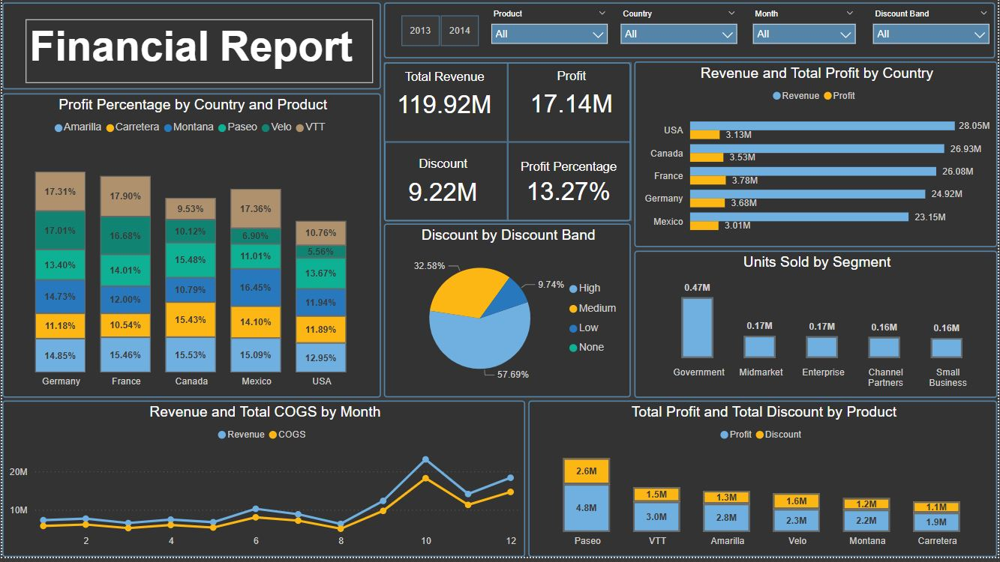

# Financial-Management-Data-Analysis
A financial report that tracks profit margins, expenses, and  revenue over time.
Developed a Power BI dashboard to analyze financial performance by tracking revenue, profit, discounts, and cost of goods sold (COGS). The report enables users to filter by product, country, month, and discount band. Key visuals include profit percentage by product and country, units sold by segment, and monthly revenue vs. COGS comparison — offering clear insights into profitability and discount strategies.

